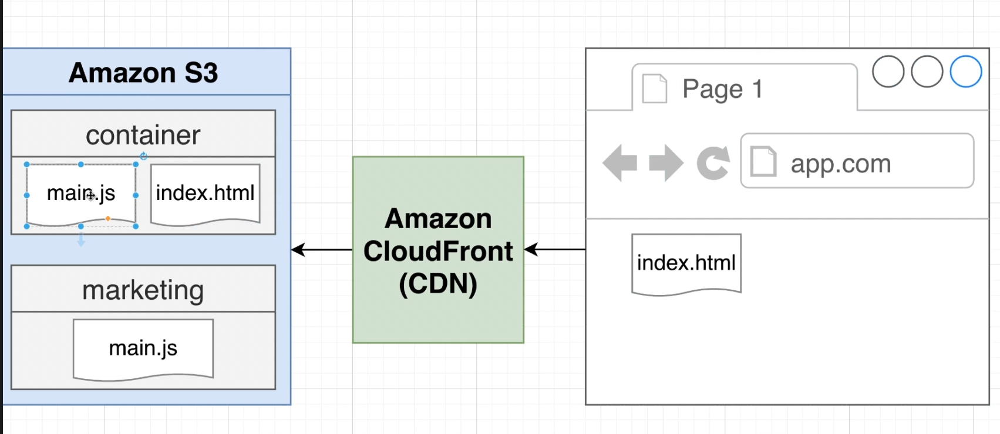

# Deployment

### Important Things to Keep in Mind

-   We want to deploy each microfrontend independently (including the container)
-   Location of child app `remoteEntry.js` files must be known at _built time_!
-   Many frontend deployment solutions assume you're deploying a single project - we need something that can handle multiple different ones
-   Need a CI/CD pipeline of some sort
-   _At present_, the _remoteEntry.js_ file name is fixed! Need to think about caching issues.

### AWS S3 and AWS CloudFront

-   Cloudfront is a CDN (Content Delivery Network)
-   Cloudfront will look at an incoming request and determine which files to pull out of our S3 bucket, and serve to the browser.



### Workflow For Deploying Container


```
      - uses: shinyinc/action-aws-cli@v1.2

          - uses: shinyinc/action-aws-cli@v1.2
          - run: aws s3 sync dist s3://${{ secrets.AWS_S3_BUCKET_NAME }}/container/latest
            env:
              AWS_ACCESS_KEY_ID: ${{ secrets.AWS_ACCESS_KEY_ID }}
              AWS_SECRET_ACCESS_KEY: ${{ secrets.AWS_SECRET_ACCESS_KEY }}
              AWS_DEFAULT_REGION: ""

```
