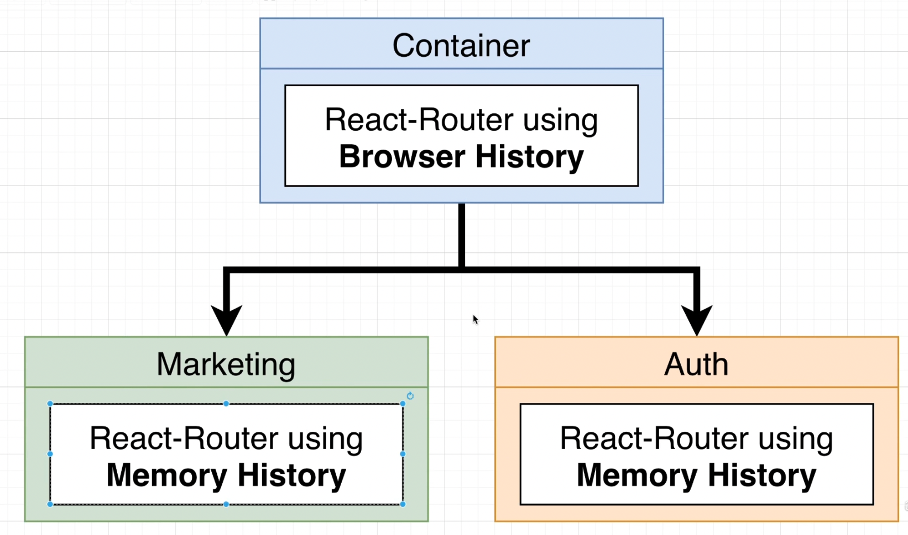

# Packages (Big Microfrontend Project)

## Important Things to Keep in Mind

- We want to deploy each microfrontend independently (including the container)
- Location of child app `remoteEntry.js` files must be known at _built time_!
- Many frontend deployment solutions assume you're deploying a single project - we need something that can handle multiple different ones
- Need a CI/CD pipeline of some sort
- _At present_, the _remoteEntry.js_ file name is fixed! Need to think about caching issues.

## AWS S3 and AWS CloudFront

- Cloudfront is a CDN (Content Delivery Network)
- Cloudfront will look at an incoming request and determine which files to pull out of our S3 bucket, and serve to the browser.


## Workflow For Deploying Container


**Question**: Why are _so many_ different javascript files being sent in prod? For example:


**Answer**: It is because of the shared modules that we declared. Inside of marketing/config/webpack.prod.js, we have a _bunch_ of shared deps, configed with the

```js
const prodConfig = {
  ...,
	plugins: [
		new ModuleFederationPlugin({
			...,
			shared: packageJson.dependencies // <- if we remove this, we get big bundles of duplicate deps...
		})
	]
};
```

## Class Name Colision

Whenever two different microservices are using the same css-in-js library, it is _possible_ that a **className colision** may occur. Note: This is a big issue that may require debugging, especially with libraries that don't have the `createGenerateClassName` func like `mui` does.

```js
const generateClassName = createGenerateClassName({
  productionPrefix: "co",
});
```

## Routing

### **Requirement #1**: **Both the Container + Indivisual Subapps need routing features**

- Users can navigate around different subapps using routing logic built into the `Container`
- Users can navigate around _in_ a subapp using routing logic build into the subapp itself
- Not all subapps will require routing

### **Requirement #2**: Sub-apps might need to add in new pages/routes all the time.

- New routes added to a subapp shouldn't require a redeploy of the container!

### **Requirement #3**: We might need to show two more microfrontends at the same time

- This will occur all the time if we have some kind of sidebar nav that is built as a seperate microfrontend

### **Requirement #4**: We want to use off-the-shelf routing solutions

### **Requirement #5**: We need navigation features for sub-apps in both hosted mode and in isolation

### **Requirement #6**: If different apps need to communicate information about routing, it should be done in as generic a fashion as possible

- Each app may be using a completely different navigation framework
- We might swap out or upgrade navigation libraries all the time - shouldn't require a rewrite of the rest of the

<hr>

**_Note:_** Routing libraries decide what content to show on the screen. All routing libraries can be brok down into two parts:

1. **_History_**: Object to get and set the current path the user is visiting. There are generally 3 different kinds of **history** objects. (3 diff ways to find current route the user is visiting)
   1. `Browser History`: Most popular by far. Looks at the path portion of the url (everything after the domain), to figure out what the current path is.
   2. `Hash History`
   3. `Memory` or `Abstract History`: Keeps track of current path is memory.
2. **_Router_**: Shows different content based on the current path.

The most common way to set up routing in a microfrontend project is like so:


The reason for this is simple: We don't want multiple `Browser History` objects trying to change change tha path at the same time. We _only_ want the Container's `Browser History` object making updates to the url.
